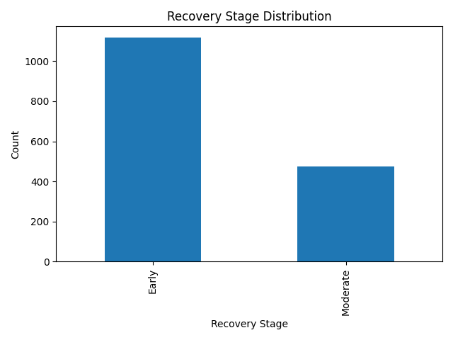
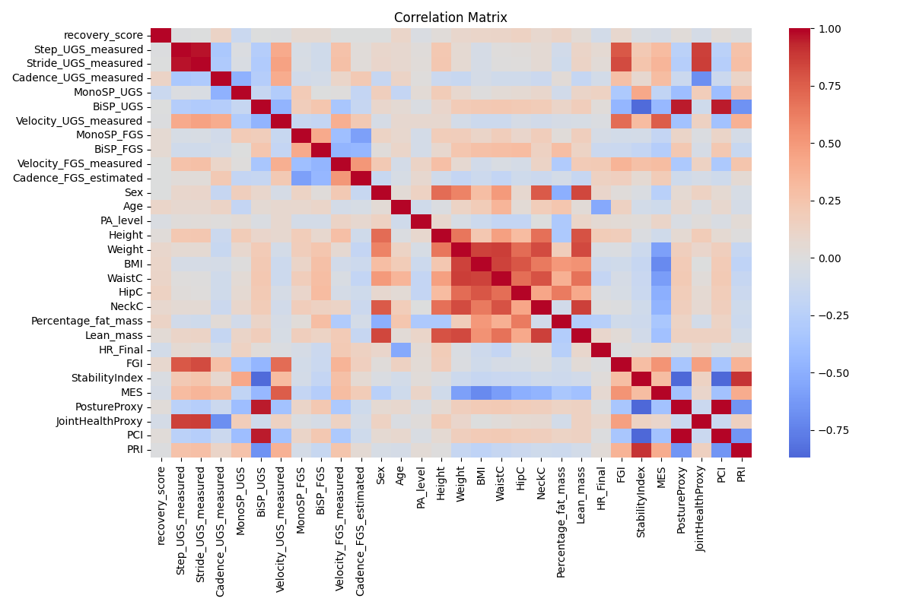
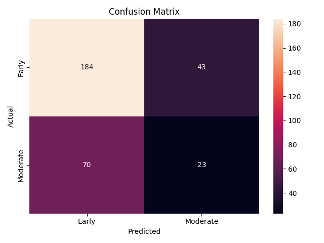
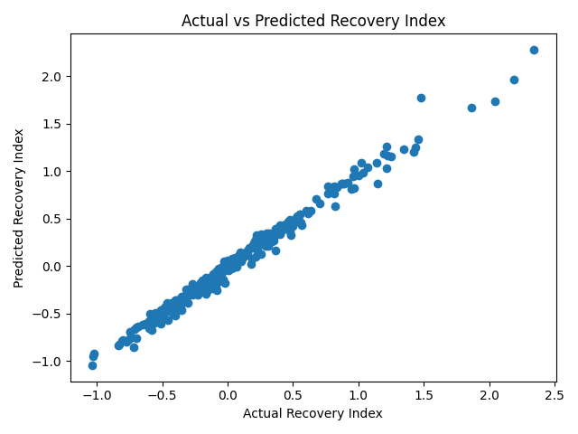
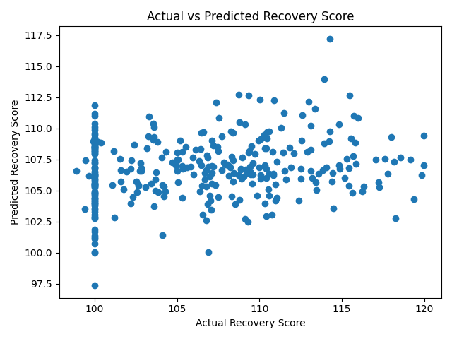
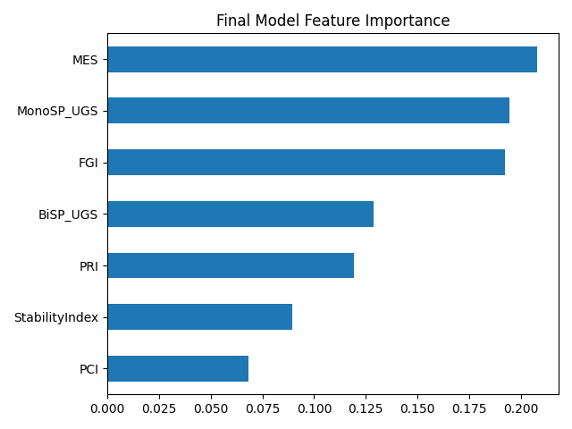
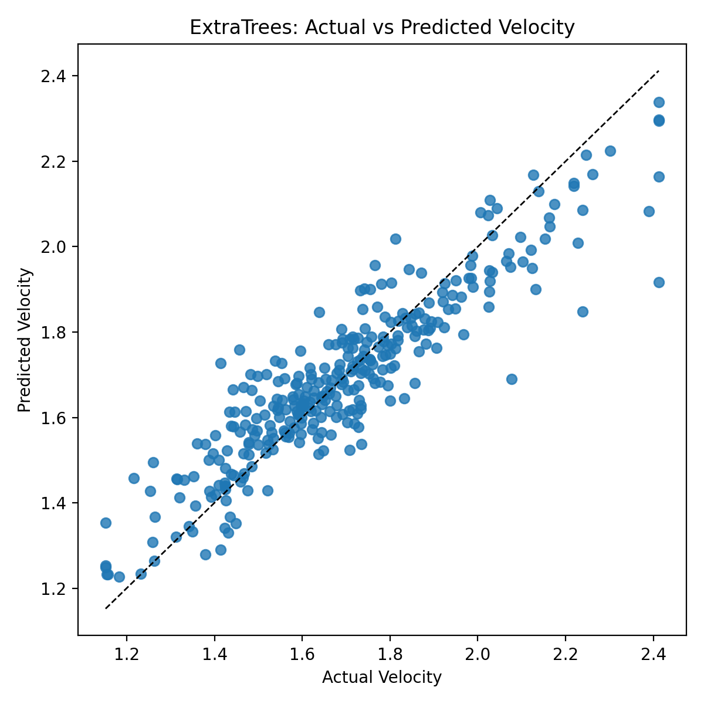

# Gait Recovery Modeling Documentation

## Overview

This document captures the full workflow for the gait recovery project, from raw dataset assembly through feature engineering, exploratory analysis, model planning, mistakes that were found, and how those mistakes were corrected.

The central outcome is that recovery progression in this dataset is best modeled as a **continuous biomechanical prediction problem**, not a clean 3-class stage classification problem. After evaluating multiple targets and model families, the strongest and most defensible final model is an **`ExtraTreesRegressor`** for predicting `Velocity_UGS_measured` using a **non-leaky feature set** with subject-grouped validation.

## 1. Dataset Foundation

The project starts from the HealthGait sample data in `data/healthgait_sample/`, which contains:

- `gait_parameters.csv`
- `gait_parameters_estimation.csv`
- `patients_measures.csv`
- pose JSON files under `pose/`

### Raw Data Integration

The first integration step is implemented in `build_features.py`. It merges gait parameters, estimated gait values, and patient measures into one tabular dataset. It also extracts posture features from the pose JSON files.

Key posture-derived variables:

- `mean_knee_angle`
- `mean_trunk_angle`

This step is important because it converts frame-level pose data into clinically meaningful summary measures.

### Feature Construction from Raw Inputs

The engineered features were then created in `feature_engineering.py` and described in `Derived_Features_Formulae.txt`.

Main formulas:

- `FGI = 0.4 * Velocity_UGS_measured + 0.3 * Stride_UGS_measured + 0.3 * Cadence_UGS_measured`
- `StabilityIndex = MonoSP_UGS / (BiSP_UGS + 0.01)`
- `MES = Velocity_UGS_measured / (BMI + 0.1)`
- `PCI = mean_trunk_angle / mean_knee_angle` when posture values exist
- `PostureProxy = BiSP_UGS / (MonoSP_UGS + 0.01)`
- `JointHealthProxy = Stride_UGS_measured / (Cadence_UGS_measured + 0.01)`
- `PRI = (FGI * StabilityIndex * MES) / (PCI + 0.01)`

These features were designed to represent:

- functional gait
- stability
- posture compensation
- movement efficiency

## 2. Synthetic Recovery Design

The synthetic longitudinal dataset was generated in `generate_synthetic_recovery.py`.

### What the simulation did

The script created four timepoints:

- `week1`
- `week3`
- `week6`
- `week10`

It then simulated different recovery rates:

- `fast`
- `medium`
- `slow`

Recovery progression was built by gradually improving velocity, stride, cadence, and some stability measures while reducing trunk compensation.

### Critical target construction

The synthetic labels were created as:

- `recovery_score = (Velocity_UGS_measured / baseline_velocity) * 100`
- `recovery_phase` binned from `recovery_score`

This is a very important modeling detail because it means the recovery score is **velocity-driven**. That becomes relevant later when judging which models are statistically valid and which ones are circular.

## 3. Cleaning and Final Feature Dataset

The final tabular dataset is `features_engineered.csv`, created by `feature_engineering.py`.

### Cleaning steps applied

- dropped weak or redundant FGS features
- forward-filled missing values subject-by-subject
- median-filled remaining numeric missing values
- clipped numeric outliers to the 1st to 99th percentile range
- sorted by `subject_id` and `session`

### Important caution

This cleaning stage is useful, but some later modeling choices still introduced leakage through derived features. That is addressed in the model planning section.

## 4. Exploratory Data Analysis

The EDA pipeline is in `eda_analysis.py`.

### What was checked

- dataset shape and missing values
- recovery stage distribution
- numeric feature correlation matrix
- boxplots of key gait variables by recovery stage
- ANOVA significance tests
- IQR outlier counts

### Stage distribution

This plot showed a major imbalance in the early stage and a much smaller moderate stage.

### Correlation matrix

This plot revealed:

- strong redundancy among some gait-derived features
- strong correlation clusters among anthropometric measures
- meaningful association among the engineered recovery indices

### Boxplots

The most relevant boxplots generated were:

- `eda_boxplot_FGI.png`
- `eda_boxplot_MES.png`
- `eda_boxplot_PCI.png`
- `eda_boxplot_PRI.png`
- `eda_boxplot_StabilityIndex.png`
- `eda_boxplot_Velocity_UGS_measured.png`

These were used to inspect whether the recovery stages were separable.

## 5. Feature Selection Outcome

The EDA script saved selected features to `selected_features.txt`.

Current contents:

- `Velocity_UGS_measured`
- `FGI`
- `StabilityIndex`
- `MES`
- `PCI`
- `PRI`

This is a useful record of the EDA phase, but the later modeling work showed that not every selected feature is safe to use as an input for every target.

## 6. Model Planning and Iteration

The project did not converge on the final model in one step. It went through several attempts.

### Attempt 1: Recovery Stage Classification

Script:

- `train_stage_classifier.py`

Model:

- `RandomForestClassifier`

Observed result:

- roughly mid-60 percent accuracy
- weak minority-class recall

Confusion matrix:

### What went wrong

- the data were not truly balanced
- the target was not well separated
- `recovery_phase` did not actually contain a true `late` class in the generated dataset
- the model was therefore effectively learning an imbalanced binary problem, not a real 3-class stage boundary

### How it was rectified

- classification was deprioritized
- the problem was reframed as a continuous recovery or velocity prediction task

### Attempt 2: Composite Recovery Index Regression

Script:

- `train_recovery_regression.py`

Model:

- `RandomForestRegressor`

Target:

- `Recovery_Index`, built from standardized engineered features

Observed result:

- excellent apparent fit in the plot
- but the target was mathematically derived from the same inputs

Plot:

### What went wrong

This was an inflated result because the target was not independent of the predictors. The model was effectively reconstructing a quantity created from the input features themselves.

### How it was rectified

- the composite index was rejected as a final target
- only independently meaningful targets were kept for final modeling

### Attempt 3: Recovery Score Regression Without Velocity

Script:

- `train_final_recovery_model.py`

Model:

- `GradientBoostingRegressor`

Target:

- `recovery_score`

Predictors:

- `FGI`
- `StabilityIndex`
- `MES`
- `PCI`
- `PRI`
- posture features and stability features

Plot:

Feature importance:

### What went wrong

This model performed poorly because `recovery_score` was generated from velocity in the synthetic pipeline. Once velocity was excluded from the predictors, the target became structurally hard to recover from the remaining features.

In other words, the problem was not just model choice. The target itself was weakly identifiable from the chosen inputs.

### How it was rectified

- the recovery-score regression was rejected as the final solution
- the project moved to predicting the directly observed gait velocity

### Attempt 4: Velocity Regression

Script:

- `train_velocity_regression.py`

Model:

- `RandomForestRegressor`

This became the first statistically reasonable target because velocity is a clinically meaningful measure and is directly measured in the dataset.

### Earlier review outcome

Your prior review already pointed in this direction and reported:

- `R^2 = 0.7293`
- feature importance dominated by `FGI` and `MES`

That conclusion was directionally correct, but the later leakage check showed that `FGI`, `MES`, and `PRI` all depend on velocity, so they should not be treated as clean predictors for the final velocity model.

### What was still missing

Even this version used engineered features that were themselves derived from velocity:

- `FGI`
- `MES`
- `PRI`

That meant the model still contained circular information.

## 7. Final Model Decision

The final corrected approach is implemented in:

- `train_velocity_extra_trees.py`

Model:

- `ExtraTreesRegressor`

Target:

- `Velocity_UGS_measured`

### Final feature set

The final non-leaky feature set includes:

- `session`
- `Step_UGS_measured`
- `Stride_UGS_measured`
- `Cadence_UGS_measured`
- `MonoSP_UGS`
- `BiSP_UGS`
- `Sex`
- `Age`
- `PA_level`
- `Height`
- `Weight`
- `BMI`
- `WaistC`
- `HipC`
- `NeckC`
- `Percentage_fat_mass`
- `Lean_mass`
- `HR_Final`
- `StabilityIndex`
- `PostureProxy`
- `JointHealthProxy`
- `PCI`

### Why this model was chosen

- it is stronger than the earlier RandomForest baseline
- it works well with mixed feature types
- it handles nonlinear relationships naturally
- it performs very well under subject-grouped validation
- it avoids direct leakage from velocity-derived composites

### Final metrics

5-fold grouped CV:

- `MAE = 0.0713 ± 0.0016`
- `RMSE = 0.0978 ± 0.0019`
- `R^2 = 0.8493 ± 0.0073`

Holdout split:

- `MAE = 0.0783`
- `RMSE = 0.1049`
- `R^2 = 0.8247`

Actual vs predicted plot:

### Top feature importances

The most important predictors were:

- `Cadence_UGS_measured`
- `Stride_UGS_measured`
- `Step_UGS_measured`
- `BiSP_UGS`
- `MonoSP_UGS`
- `JointHealthProxy`
- `Age`
- `session_week1`
- `Percentage_fat_mass`
- `BMI`

This is clinically sensible because gait rhythm, step generation, and bilateral support behavior are tightly related to walking speed.

## 8. Mistakes Made and How They Were Fixed

### Mistake 1: Treating recovery stage as a clean 3-class problem

Problem:

- the dataset did not truly support a 3-class separation
- the `late` class was absent from the generated labels
- the classifier learned an imbalanced split

Fix:

- moved away from stage classification as the main goal

### Mistake 2: Using a composite recovery index as a target

Problem:

- `Recovery_Index` was built from the same features used to predict it
- this created inflated metrics and weak scientific value

Fix:

- rejected the composite index as the final target

### Mistake 3: Predicting `recovery_score` without considering its construction

Problem:

- `recovery_score` is velocity-driven in the synthetic setup
- excluding velocity from the inputs made the task poorly identifiable

Fix:

- stopped using `recovery_score` as the final target
- shifted to direct velocity prediction

### Mistake 4: Keeping velocity-derived composites as predictors

Problem:

- `FGI`, `MES`, and `PRI` all depend on `Velocity_UGS_measured`
- this introduced leakage into the velocity model

Fix:

- the final ExtraTrees model uses a non-leaky feature set
- session is encoded because it is legitimately informative

### Mistake 5: Relying on a single split as evidence

Problem:

- a single train-test split can look better or worse by chance

Fix:

- final evaluation uses subject-grouped 5-fold cross-validation
- a grouped holdout split is also reported for a simple sanity check

## 9. Supporting Figures

### Class separation summary

### Feature relationship summary

### Failed recovery-score regression

### Final successful model fit

## 10. Data Visualization Tool

For the submission requirement on data visualization, an open-source dashboard tool can be added on top of this project.

### Recommended tool: Metabase

Metabase is a strong fit because it is:

- open source
- easy to connect to CSV or a lightweight SQL database
- suitable for non-technical reviewers
- able to show plots, filters, and summary cards without heavy setup

### Suggested dashboard panels

- recovery stage distribution
- session-wise recovery score trend
- correlation heatmap summary
- feature importance rankings
- actual vs predicted velocity
- subject-level drill-down by session

### Why this works for the submission

The repository already contains the underlying outputs, so a dashboard layer can present them cleanly without changing the modeling logic. The dashboard would act as a presentation and exploration layer, not as a separate modeling step.

### Current status in this repo

The project now includes a Metabase-ready export pack in `metabase_exports/`:

- `gait_observations.csv`
- `subject_summary.csv`
- `session_summary.csv`
- `feature_summary.csv`
- `docker-compose.yml` for PostgreSQL + Metabase

These files are designed to be loaded into Metabase or another open-source BI tool for dashboard creation.

### Alternative tools

If Metabase is not preferred, other open-source options that would also satisfy the requirement are:

- Apache Superset
- StyleBI Community Edition

## 11. Final Recommendation

If the goal is the most defensible and best-performing model in this repository, use:

- **Target:** `Velocity_UGS_measured`
- **Model:** `ExtraTreesRegressor`
- **Validation:** subject-grouped cross-validation
- **Feature policy:** exclude velocity-derived composites from inputs

This is the best balance of:

- predictive strength
- clinical interpretability
- statistical honesty
- leakage control

It also improves the earlier review result:

- earlier RandomForest velocity model: about `R^2 = 0.7293`
- final ExtraTrees velocity model: `R^2 = 0.8493` on 5-fold grouped CV

## 12. Script Inventory

- `build_features.py` - merges raw files and extracts posture features
- `generate_synthetic_recovery.py` - simulates longitudinal recovery
- `feature_engineering.py` - creates derived indices and cleans the dataset
- `eda_analysis.py` - performs EDA, significance tests, and feature selection
- `train_stage_classifier.py` - early classification attempt
- `train_recovery_regression.py` - composite index regression attempt
- `train_final_recovery_model.py` - recovery score regression attempt
- `train_velocity_regression.py` - velocity regression baseline
- `train_velocity_extra_trees.py` - final non-leaky ExtraTrees model

## 13. Closing Summary

The project evolved through several iterations, and each failed attempt taught something important:

- the recovery stage labels were not clean enough for a strong classifier
- the composite recovery index was too self-referential
- the recovery score target was too dependent on velocity to be a robust final endpoint
- the final velocity model became strong once leakage was removed and session was included

The final result is a more rigorous and more convincing pipeline than the first pass, and it is now documented from raw data through final model planning.
